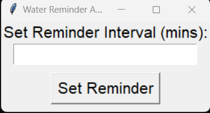
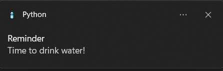

# Water Reminder App

The Water Reminder App is a simple application that reminds you to drink water at regular intervals. It utilizes the Tkinter library for the GUI, PyStray for the system tray integration, and Win10Toast for displaying reminders.

## Features

- Set a reminder interval in minutes.
- Minimize the application to the system tray.
- Receive reminder notifications to drink water.
- Change the reminder interval on the fly.
- Close the application from the system tray.

## Prerequisites

- Python 3.x
- tkinter package (usually included with Python)
- pystray package (`pip install pystray`)
- Pillow package (`pip install pillow`)
- win10toast package (`pip install win10toast`)

## Usage

1. Install the required packages by running the following command:

 pip install pystray pillow win10toast

2. Download or clone the repository.

3. Run the `water_reminder.py` file using Python:

py water_reminder.py or python water_reminder.py

4. The application window will open. Enter the reminder interval in minutes and click the "Set Reminder" button.

5. The application will be minimized to the system tray, and you will receive reminder notifications at the specified interval.

6. To change the reminder interval, right-click the system tray icon and select "Change Interval".

7. To close the application, right-click the system tray icon and select "Exit".

8. If you encounter issues with the notifications persisting in the Windows settings, you can remove them by following these steps:
- Open the Windows Registry Editor (press `Win + R`, type `regedit`, and hit Enter).
- Navigate to the following path: `HKEY_CURRENT_USER\Software\Microsoft\Windows\CurrentVersion\Notifications\Settings`
- Look for entries starting with `NotifyIconGeneratedAumid_`.
- Delete all entries starting with `NotifyIconGeneratedAumid_` to remove them from the notifications and settings.

## Screenshots

## Contributing

Contributions are welcome! If you encounter any issues or have suggestions for improvement, please open an issue or submit a pull request.

## License

This project is licensed under the [MIT License](LICENSE).

